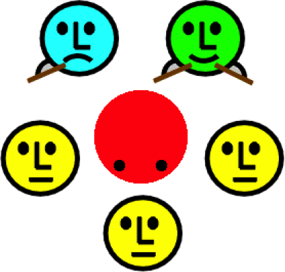

# Concurrency: State Models and Design Patterns

This repo contains the lecture material for the MSc level course “Concurrency: State Models and Design Patterns”.
The course was last held in the Fall of 2021.

## Description

This course provides an introduction to concurrent programming with Java. The course focuses on fundamental concepts important for developing correctly functioning concurrent programs, such as safety, liveness and fairness, and on standard programming patterns and techniques for dealing with these issues. The course will include two lab sessions (replacing the regular lecture hours) in which students will work in small groups to apply the techniques presented.

Much of the practical material in this lecture will be based on: Doug Lea, [Concurrent Programming in Java: Design Principles and Patterns](http://gee.cs.oswego.edu/dl/cpj/index.html), Addison-Wesley, 1999. The theoretical foundations will be based on: Jeff Magee and Jeffrey Kramer, [Concurrency: State Models & Java Programs](https://www.doc.ic.ac.uk/~jnm/book/), John Wiley, 1999.

## Learning Outcomes

On successful completion of this course, you will be able to:

- Reason about safety, liveness and fairness in concurrent programs
- Use model-checking tools to prove safety and liveness properties
- Use synchronization mechanisms to guarantee thread safety in programs
- Reason about communication mechanisms to manage threads
- Use practical techniques to avoid deadlock and ensure liveness
- Reason about architectural styles to avoid concurrency issues

## Slides

The slides have been prepared with Apple Keynote. Interspersed with the slideware are hidden slides containing notes for students. PDF versions of the slides can be found [here](http://scg.unibe.ch/download/lectures/cp/).

The figures for the slides have mostly been prepared using [OmniGraffle](https://www.omnigroup.com/omnigraffle/).

## Repo

This repo lives on [github](https://github.com/onierstrasz/course-concurrent-programming).
Further resources can be found on the [course web site](http://scg.unibe.ch/teaching/cp).

This work is licensed under a [Creative Commons Attribution-ShareAlike 4.0 International License](http://creativecommons.org/licenses/by-sa/4.0/).

---
